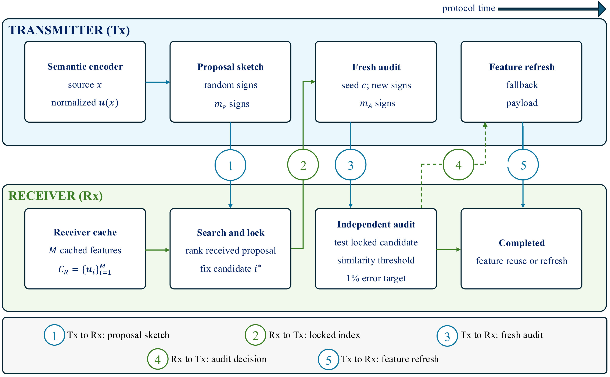

# SentrySem: Reliable Semantic Cache Reuse After Noisy Search

[](https://github.com/HosseinAhmadi63/SentrySem-Semantic-Cache-Reuse/actions/workflows/tests.yml)
[](https://www.python.org/downloads/release/python-3120/)
[](LICENSE)

This repository contains the complete reference implementation and frozen experimental artifacts for **SentrySem**, a semantic communication protocol that safely reuses a receiver-side cached feature after noisy candidate search.

**Authors:** [Hossein Ahmadi](https://orcid.org/0000-0002-3650-0280), Zahra Ziar, and [Ali Kuhestani](https://orcid.org/0000-0003-0725-3230)

Semantic caching can reduce communication when the receiver already stores a useful representation of the current source. The central difficulty is statistical: searching many cache entries makes the winning search score overly optimistic. SentrySem resolves this by separating candidate discovery from certification. A proposal sketch identifies and locks one cache candidate; an independent audit then decides whether that fixed candidate can be reused. A rejected audit triggers transmission of the current quantized feature, so every session finishes with a verified cached representation or a refresh.



## Main results

The paper configuration uses a frozen ImageNet-pretrained ResNet-18 encoder, CIFAR-10 repeated-view queries, a 1% verifier-level error target, and a 256/768 proposal-audit split selected on development data. The channel is modeled as a binary symmetric channel (BSC).

| BSC crossover probability | Cache reuse | Source-instance precision | Mean completion traffic | Reduction from 4.272 kbit refresh |
|---:|---:|---:|---:|---:|
| 0 | 86.80% | 99.723% | 2.508 kbit | 41.29% |
| 0.05 | 83.04% | 99.710% | 2.669 kbit | 37.53% |

The boundary experiment also isolates the post-selection effect. With 64 searched candidates, reusing the 64-sign search evidence produced 25.15% false acceptance, while a fresh independent audit produced 0.45% at the 1% target.

## Repository contents

```text
SentrySem-Semantic-Cache-Reuse/
├── .github/workflows/       Continuous integration
├── .run/                    Shared PyCharm run configurations
├── artifacts/
│   └── frozen_inputs/       Frozen embeddings, calibration, and provenance
├── configs/                 Paper and fast-check configurations
├── docs/                    Reproduction and result documentation
├── figures/
│   ├── paper/               Manuscript figures and editable Figure 1 source
│   └── generated/           Figures created by local runs
├── results/
│   ├── paper/               Immutable reference results
│   ├── generated/           Fresh full reproductions
│   └── smoke/               Fast end-to-end checks
├── scripts/                 Direct script entry points
├── src/sentrysem/           Installable Python package
├── tests/                   Unit and integration tests
├── main.py                  Repository command-line interface
├── pyproject.toml           Package and tool configuration
├── requirements.txt         Exact runtime dependencies
├── requirements-raw.txt     Additional raw-image dependencies
└── environment.yml          Conda environment specification
```

`artifacts/frozen_inputs/` and `results/paper/` are part of the repository. The default verification and reproduction paths therefore work offline after dependency installation.

## Installation

Python 3.12 is the reference interpreter. From the repository root:

```bash
git clone https://github.com/HosseinAhmadi63/SentrySem-Semantic-Cache-Reuse.git
cd SentrySem-Semantic-Cache-Reuse
python3.12 -m venv .venv
source .venv/bin/activate
python -m pip install --upgrade pip
python -m pip install -e .
```

On Windows PowerShell, activate the environment with:

```powershell
git clone https://github.com/HosseinAhmadi63/SentrySem-Semantic-Cache-Reuse.git
cd SentrySem-Semantic-Cache-Reuse
py -3.12 -m venv .venv
.venv\Scripts\Activate.ps1
python -m pip install --upgrade pip
python -m pip install -e .
```

Install the testing tools with:

```bash
python -m pip install -e ".[dev]"
```

Conda users can create the same environment with:

```bash
conda env create -f environment.yml
conda activate sentrysem
python -m pip install -e .
```

## Verify the published artifacts

Run the read-only verifier first:

```bash
python main.py verify
```

The verifier checks frozen-input hashes, required schemas, experiment dimensions, seed separation, exact protocol invariants, headline values, and the completeness of the paper figures. It writes no files and finishes with `PASS` when all checks succeed.

## Reproduce the paper experiments

The following command reruns the allocation study, protocol comparisons, selected-method evaluation, stress conditions, cluster bootstrap, and publication figures from the frozen embeddings:

```bash
python main.py reproduce --config configs/paper.json --overwrite
```

Fresh numerical results are written to:

```text
results/generated/comparators/
results/generated/allocation/
results/generated/stress/
results/generated/calibration/
results/generated/validation/
results/generated/reproduction_manifest.json
```

Fresh figures are written to `figures/generated/`. The immutable reference files under `results/paper/` and `figures/paper/` remain unchanged.

To assemble a fresh figure set from the checked-in paper results:

```bash
python main.py figures
```

Figure 1 is a conceptual system diagram rather than a data plot. Its reviewed PDF, PNG, and SVG exports are copied unchanged to `figures/generated/`; the editable PowerPoint source is `figures/paper/Figure_1_System_Model.pptx`. Figures 2--7 are regenerated from the frozen numerical and image records.

## Run a fast end-to-end check

```bash
python main.py smoke
```

This command exercises configuration loading, candidate search, independent certification, fallback accounting, and summary generation on a reduced deterministic workload. Its output is written to `results/smoke/smoke_results.json`.

## Rebuild the frozen embeddings from images

The full raw-image route downloads CIFAR-10 and the TorchVision `ResNet18_Weights.IMAGENET1K_V1` checkpoint when they are absent from the local cache. It then recreates the deterministic source partitions, repeated views, strong-shift views, novel-source set, normalized 512-dimensional features, calibration data, and provenance manifests:

```bash
python -m pip install -e ".[raw]"
```

```bash
python main.py extract-embeddings --config configs/paper.json --output artifacts/generated_inputs
```

Run every downstream experiment from those newly generated inputs with:

```bash
python main.py reproduce --config configs/paper.json --inputs artifacts/generated_inputs --overwrite
```

The checked-in frozen inputs remain available for direct comparison. The reference feature archive has SHA-256 digest `77173ff70b1fbe318219692771120ade7aa430fc2a0683b82f25a486631d88a0`.

## Protocol sequence

The five numbered arrows in Figure 1 show logical message directions. Arrow 3 groups the two consecutive transmitter-to-receiver audit frames. The serialized pre-refresh transaction therefore contains five frames:

1. the transmitter sends the proposal signs;
2. the receiver sends a candidate-lock record after its local cache search;
3. the transmitter sends the fresh audit seed;
4. the transmitter sends the audit signs; and
5. the receiver sends the reuse-or-refresh decision.

The cache search is receiver-local computation rather than a transmitted frame. When the decision is refresh, the transmitter sends one additional feature-refresh frame containing the current quantized semantic feature; this conditional transmission is arrow 5 in Figure 1.

## Reference configuration

- Dataset: CIFAR-10.
- Encoder: TorchVision ResNet-18 with `IMAGENET1K_V1` weights and the classification layer replaced by identity.
- Feature: 512-dimensional global-average-pooled vector with L2 normalization.
- Input: RGB, bilinear resize to 128 × 128 with antialiasing, followed by ImageNet normalization.
- Calibration threshold: cosine similarity `0.7717004776000975`.
- Proposal and audit: random-hyperplane signs with 256 proposal bits and 768 independent audit bits.
- Channel conditions: binary symmetric channel crossover probabilities 0 and 0.05.
- Verifier target: `alpha = 0.01`.
- Reference refresh: 512 signed 8-bit feature values, one 32-bit scale, and one 144-bit frame, totaling 4,272 bits.
- Base seed: `20260907`, with predeclared and disjoint development and evaluation protocol-seed sets.

See [docs/REPRODUCIBILITY.md](docs/REPRODUCIBILITY.md) for the full experimental contract, [docs/PAPER_TO_CODE.md](docs/PAPER_TO_CODE.md) for the paper-to-implementation map, and [docs/RESULT_SCHEMA.md](docs/RESULT_SCHEMA.md) for output definitions.

## Tests

```bash
python -m pytest
```

The test suite covers the exact binomial boundary, noisy sign probability, candidate-lock independence, deterministic seeds, bit accounting, summary calculations, configuration validation, and a compact end-to-end run.

## PyCharm

Open the repository root as a PyCharm project, select `.venv/bin/python` (or `.venv\Scripts\python.exe` on Windows), and use the committed run configurations. Detailed setup and output locations are documented in [docs/PYCHARM.md](docs/PYCHARM.md).

## Citation

Citation metadata are provided in [CITATION.cff](CITATION.cff). GitHub displays the corresponding citation through its **Cite this repository** interface.

## License

The original source code is released under the [MIT License](LICENSE). CIFAR-10-derived assets and pretrained model outputs retain their applicable upstream terms; their scope and provenance are documented in [THIRD_PARTY_NOTICES.md](THIRD_PARTY_NOTICES.md).
